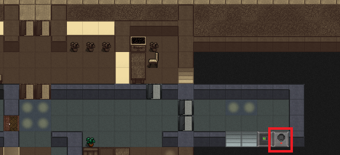

# スポイラー情報
## 目次
1. [Tips](#Tips)
1. [ミッション攻略](#ミッション攻略)
1. [ミッション補足説明](#ミッション補足説明)
1. [実績](#実績)
1. [後輩のステータス](#後輩のステータス)
1. [ダイアログについて](#ダイアログについて)
1. [デバッグ情報](#デバッグ情報)

## スポイラーについて
このMODの攻略情報を記載しています。 
攻略に際してHUB01のミッションを進行する必要があるため、HUB01ミッションのネタバレも多く含まれています。

## Tips
- 後輩はあなたと同じ一般人です。普通に死にますので守ってあげてください

- 会話より(気分転換に雑談に誘う)⇒(雑談を楽しむ)を選ぶと「後輩と楽しく会話した」効果により少しの間意欲が+15されます(上限:+30)。
   - もしあなたが「冷酷」か「無関心」の場合は選択肢が(雑談を聞く)となり、「興味のない会話」により意欲が-5されます(下限:-20)
   - 会話による意欲の変化は2時間継続し、その後1時間かけて0に戻ります(つまり効果は3時間続きます)
   - 5時間後にまた会話できるようになります
- 後輩はあなたと同じ一般人です。普通に死にますので守ってあげてください

- ミッションの進行状況によって雑談が特殊な会話になる場合があります
   - この特殊な会話を聞くと「後輩の思いを聞いた」効果になり、少しの間意欲が+20になります。(上限:+35)
   - あなたが「冷酷」が「無関心」なら、意欲の変化はありません(上がりませんが下がりません)
   - 会話による意欲の持続時間は通常の雑談と同じです

- (出会うまでの話を聞く)で後輩の話を最後まで聞くと、「後輩と出会った日の話を聞いた」効果が付与されてしばらく意欲が+20されます(最大35)
   - この効果は一度きりですが20時間持続し、その後4時間かけて0に戻ります
   - こちらは「冷酷」でも「無関心」でも効果があります。(あなたの大切な後輩ですから)

- ミッションはフレーバー優先です。クリアしたら強力なアイテムがもらえるなんてことはありませんし、強力じゃないアイテムももらえません。 
なので急いで攻略する意味は全くありませんが、ミッション1だけはまず開始しておいた方がよいです。(攻略参照)

- 隣接していなくても【C】⇒【t】で会話ができます

## ミッション攻略
### ミッション1 「科学研究所を目指そう」
- 開始条件 
大変動から6日目以降※に後輩と会話すると(\[ミッション\]相談を聞く)が選択肢に現れるので選んでミッションを開始する 
※ゲーム開始翌日を想定しています(「避難者」シナリオは大変動から5日目開始) 
　この選択肢で\[ミッションを無効にする\]を選ぶと以降二度とミッションを提示しなくなります。

- クリア条件 
「科学研究所」で会話する

- ミッション報酬 
特になし。危険はありますが科学研究所の地下3マップに配置されたアイテムが略奪可能です

- ウォークスルー(ヒント) 
1. 目的地の科学研究所で両方が内側に居る状態で会話し、(\[ミッション\](研究所に着いた……)」を選ぶとクリア 
   - 目的地でない科学研究所でもクリア条件を満たします。
   - ミッションのためなら地下に入る必要はありません。
   - 目的地は地下3マップ確定のこのミッション専用ラボです。 
3マスなので最奥の部屋がふたつあり運がよければ図書室や武器庫になりますが、運が悪ければ巨大骸骨とかショゴスがいる場合もありますので潜るときは気をつけて。

### ミッション2「HUB01に行こう」
- 開始条件 
  - ミッション1クリア後、まだHUB01のインターコムに話しかけていない場合(通常ルート) 
    1. 後輩との会話に(\[ミッション\]相談を聞く)が現れるので選ぶ 
    ※ハブ01は世界にひとつしか存在できないので、探索に数十秒～かかる場合があります。フリーズしたように見えても気長に待ってください。

  - ミッション1クリア前にHUB01のインターコムに話しかけた場合(先行ルート)
    1. インターコムに話しかける
    1. 後輩との会話に(\[ミッション\]相談を聞く)が現れるので選ぶ 
     ※ミッション1開始前に先行ルートに入ると、ミッション1の開始条件が失われて二度とミッション1が始められなくなります。 
     　このルートではミッションの無効化もできません。

- クリア条件 
  1. 後輩と会話してHUB01への協力を決める(通常ルート/先行ルート)
  1. 上記を実施せずにミッション3のクリア条件を満たす(スキップルート)

- ウォークスルー(ヒント)
  - 通常ルート
    1. HUB01にたどりつき、インターコムに会話する 
  HUB01で会話するとちょっとしたダイアログがあります
    1. HUB01で(アリーヤ博士に……)を選ぶ
    1. 後輩と会話し、(\[ミッション\]聞く耳を持たないようだ)を選ぶ

  - 先行ルート
    1. HUB01で(アリーヤ博士に……)を選ぶ
    1. 後輩と会話し、(\[ミッション\]聞く耳を持たないようだ)を選ぶ

  - スキップルート
    1. ミッション3のクリア条件を満たしたあと、**初めて**(アリーヤ博士に……)を選ぶ 
    ※ この場合はミッション3は単に消滅します。

- ミッション報酬 
特になし。HUB01の場所が明らかになります。

   
参考: HUB01 インターコムの位置

### ミッション3「ハブの信用を得るには」
- 開始条件 
  - ミッション2終了後に自動開始 
  ※ミッション2をスキップルートでクリアした場合はこのミッションは開始できません。

- クリア条件
  - いずれかを実施後、後輩と会話してミッション選択肢を選ぶ
    1. 「無言の帰還」と「鉄塊狩り」を成功し、インターコムで(そろそろ……)を選ぶ
    1. 「輝かしい捜索任務」をクリアし、インターコムで(そろそろ……)を選ぶ
    1. ミッション2をスキップルートでクリア

- ミッション報酬 
特になし。

- ウォークスルー(ヒント) 
下記参照。 
#### その1(HUBと取引するための前提ミッション)
1. HUB01のミッション「実地データを回収する」をクリアする 
   - 開始条件
      - インターコムから「協力できることが～」を選んでミッションを開始する
   
   - クリア条件
      - 博士が持っている「試作通信レコーダー」をインターコムに持ち帰る

   - ミッション報酬
      - 本編に準拠

   - ウォークスルー(ヒント)
      - ミッション説明の通りロボットは遠隔攻撃手段こそ持っていませんが、かなり堅くけっこう素早いのでまともにやり合うのは危険です
      - 強力な遠距離攻撃か、クルマやバイクなどの接近を拒否する手段が必要です
      - 遠隔武器を使うつもりなら、弓矢では装甲を抜けないことを知っておいたほうがいいでしょう 
      ライフルやショットガンなら一応大丈夫です。
      - 説明にあったEMP手榴弾は博士がふたつ持っていますが、準備なく徒歩で近づいたりしたらたぶん手に入れる前にロボットに殺されます
      - 自分で用意するなりバイクで素早くかすめ取るなりできたなら、手に持って【w】、ピンを抜けば【a】数ターン後に自動的に起爆します 投擲【t】するか足下に落とす【d】かは距離と状況次第です 
      ※もしすっぱ抜けて足下に落ちても拾って投げ直せばなんとかなるかもしれませんし、そのまま離れた方がマシかもしれません
      - 機械整備が得意ならクルマで体当たりして弾き飛ばす方法もアリです

#### その2 
1. 「無言の帰還」をクリアする(「鉄塊狩りと順不同)
    - 開始条件
      - インターコムから「雇用契約について～」を選んで受注する
      - 他の雇用契約と同時受注可能(2つまで受注できます)
    - クリア条件
      - ミッション目標地から「DARPAハードケース」を持ち帰る
    - ミッション報酬
      - 本編に準拠
    - ウォークスルー(ヒント)
      - 大量の兵士ゾンビの徘徊する軍事車両の事故地点からアイテムを回収するクエストです
      - 中には装甲ゾンビも混ざっています。この「装甲」とはパワーアーマーのことで、コイツを着込んでいるので.223口径ライフルでは抜けません
      - 装甲ゾンビと戦うつもりなら.308口径以上のライフルが必要です
      - 火力に不安があるならバイクなどで釣り出してから素早く戻り、ターゲットを回収して離脱するのがよいです。 
        酸を吐いてくるゾンビなども居ますので、厄介な相手をピンポイントで処分できるくらいの戦闘力はあった方がよいです。
      - 逆に言えばヘビーマシンガンを搭載したクルマなどの十分な火力を持っているなら、それほど苦労せず攻略でき軍用装備も手に入る美味しいミッションと言えるかもしれません

1. 「鉄塊狩り」をクリアする(「無言の帰還」と順不同)
    - 開始条件
      - インターコムから「雇用契約について～」を選んで受注する
      - 他の雇用契約と同時受注可能(2つまで受注できます)
    - クリア条件
      - ミッション目標地にいるターゲットを停止させ「トリファセット(停止)」を持ち帰る
    - ミッション報酬
      - 本編に準拠
    - ウォークスルー(ヒント)
      - ターゲットを生け捕りにする毛色の変わったミッションです
      - ターゲットは停止すると50L, 30Kg, 37cmの物体になります。持ち帰る方法を考えておきましょう
      - ミッションの説明と開始時にもらったアイテムをしっかり確認しましょう
        - ターゲットを壊したら失敗です
        - 説明書は読みましょう。
        - 電子工学や機械整備の技術は、どちらかの**知識**が最低1あれば大丈夫のはず
        - UPSは充電しましょう(装填【r】でツールバッテリーから給電)
        - UPSの電源は入れましょう(使用【a】)
        - 試作ライフルの弾は電力で、電源が入っており充電のあるUPSがマガジンとして扱われます。UPSは荷物に持っているだけで撃てます
      - ターゲットは足が速く、すぐに死ぬような威力ではないものの電気銃を撃ってきます。 
        森のそばの地形の悪い場所が選ばれますので、接近するつもりなら小回りの利く車両に乗って行きましょう
      - 対象は単体でうろついています。もらったライフルで撃つ⇒スタンしたら近づいて【e】キーから停止を選ぶだけです 
      ※ミッションの結果如何によらずこの試作ライフルは自分の物になります。 
      　敵ロボットを同じようにスタンさせ、停止させられるようになる優れものですが、アンドロイドはロボットではないのでダメです 
        　もちろん普通に銃を撃った方が手っ取り早くて安全なのですが、停止したロボットを無傷で手に入れられる貴重な手段の一つです

#### その3 
1. 「輝かしい捜索任務」をクリアする
    - 開始条件
      - インターコムから「雇用契約について～」を選んで受注する
      - 他の雇用契約と同時受注可能(2つまで受注できます)
    - クリア条件
      - ミッション目標地から「ナノ製造テンプレート(フォトニック回路)」を持ち帰る
    - ミッション報酬
      - 本編に準拠
    - ウォークスルー(ヒント)
      - 街中にあるビルの地下からアイテムを回収するクエストです
      - 街中、特殊敵、閉所の多い地下、毒ガス地形ありという難クエストです。しっかり準備していきましょう
      - 殺すと爆発して毒ガスを撒くタイプの敵が多く居り、地下で、閉所のくせに4マップの広さがあるので速攻の略奪は事実上不可能です
      - HUB01から入手できる防護スーツとマスクは毒ガスの対策に有効ですので上手く活用しましょう
      1. 対象のビル周辺に居るゾンビを掃除して後方の安全を確保 
          - 長期戦になるはずなので、怪我をして戻ってきたらゾンビに囲まれた、なんてことにならないようにしましょう
          - 街中なので大量のゾンビを片付ける火力が必要です。グレネード、手榴弾、マシンガン、何でも構いません
          - クルマを拠点にしてもよいですが、ベッドで休めるように近くの建物をキャンプにしてもいいと思います

      1. ビルの1Fを片付け 
          - 毒ガス対策にガスマスクなどの準備をしましょう。 
          - ガスマスクはフィルターを装填【r】したり使う【a】で有効にしないとならないタイプもあります。 
          - 予備のフィルターもあった方がいいかもしれません 

      1. ビルの地下を片付け 
          - 暗いです。ガスマスクに加えて明かりの用意をしましょう。
          - 峡所で咄嗟の遭遇戦が発生するので、包帯や消毒薬など怪我にも備えておくべきです。
          - のぞき込み【X】や自動のぞき込みを活用して先制攻撃を受けないようにしましょう。
          - 毒ガスを吸い込んだり怪我をしたりしたらいったん引き上げて、回復してから改めて攻めましょう
          - 手榴弾も有効です。投げるときには目的のアイテムを破壊したりしないように気をつけましょう 
            ※汚いところには投げても大丈夫です。貴重品や目標はきれい目な場所に配置されています。 
            ※手榴弾は曲がり角やドアの影からのぞき込んで【X】から投げる【t】ことで比較的安全に放り込めます 
            ※投擲スキルが低いとすっぱ抜けて足下に落ちたりするので気をつけましょう。爆発に巻き込まれるとたぶん死にます
          - 目的のアイテムのほかにもナノマテリアルとかブループリントとか珍しいアイテムが配置されています。

### ミッション4「アリーヤ博士の行方を追う」
- 開始条件(いずれか)
  1. ミッション3をクリアし、後輩と会話して\[ミッション\](アリーヤ博士の行方について)の会話をする
  2. ミッション2をスキップルートでクリアし、後輩と会話して\[ミッション\](アリーヤ博士の行方について)の会話をする
  ※ターゲットは世界にひとつしか存在できないので、探索に数十秒～かかる場合があります。フリーズしたように見えても気長に待ってください。

- クリア条件
  - ミッション目的地で後輩と会話する

- ミッション報酬 
特になし。

- ウォークスルー(ヒント) 
1. マップに表示された場所へ行き、現地で後輩と会話するだけです。特に危険はないはずです 
※ 依頼主は「何か見つけたら～」と言いますが、ミッションに関わる目標は何もありません。

- ミッション報酬 
特になし。中央研究所の場所が明らかになります

### ミッション補足説明
- 中央研究所を探してもこのmodに関わるオブジェクトは一切ありません
- スキップとかでもしフラグ壊れてたら教えてください。
　
## 実績獲得条件
1. 後輩と出会った 
 後輩と会話し(出会うまでの話を聞く)、を最後まで聞く
1. アリーヤ博士の残したもの 
 ミッション4「アリーヤ博士の行方を追う」を完了する

## 後輩のステータス
　可憐で外向的な楽天家です。

　ランダムで付与されるその他の特質は、必ずしもNPCにとって意味のあるとは限りません(暑がり/寒がりなど)。賑やかしです。

　基本的には仲間として役に立つように初期能力をやや強力にしてはいるものの、有能な仲間ではなく高校生としてのデザインなのでスキル構成はそれなりです。

　特質や外見はランダムなのどうしても気に入らなければ世界を初期化してプレイヤーの新規作成をしてください。

### 基本ステータス(腕力、器用、知性、感覚)
すべて8から12 
基本ステータス8に1/2で+1することを4回繰り返すので、ステータスは9-10程度に収まる可能性が高いです 

### 装備と持ち物
職業「高校生」の服装「女性」で開始したときと同じで、下半身装備がジーンズでなくスカートです

### スキル構成(生い立ち) 
- 情報科学者の娘(コンピュータ:4)
- 高校生(応用化学:2)
- 料理好き(調理:4)
- コミュ強(社交:3)
- アクティブ(運動:3, 投擲:1, 打撃武器:1, 斬撃武器:1, 刺突武器:1, 回避:1)
- 運転免許(車両:2, 機械整備:1)
- 日常のサバイバル(制作:1, 医療:1, サバイバル:1)

### 特質(100%)
  - 可憐
  - 外向的
  - 楽天家

### 特質(各10%で取得)
- 耐性
  - 寒さ耐性/寒がり(どちらか一方)
  - 暑さ耐性/暑がり(どちらか一方)
  - 痛覚耐性
  - 毒耐性
  - 病気耐性
  - 感染症耐性
  - 堅牢な遺伝子
- 行動
  - 高反射神経
  - 俊敏
  - 快速
  - 忍び足
  - 不屈
  - 機敏な動き
  - 整理上手
- その他
  - ジャンクフード好き
  - 高速治癒
  - 高速睡眠
  - 少食
  - 速習
  - 速読
  - 体臭が薄い
  - 偵察力
  - 夜目
  - 優れた聴覚

### プロフィール
- ジェンダー
  - 女性
- 年齢
  - 16
- 身長
  - 158cm
- 髪色
  - 90%で金髪/黒髪/茶髪
  - 10%で赤髪/銀髪/白髪
- 髪型
  - 18%でショート(ショート/ノーバンクショート/ワンサイドショート/モダン/パフ)
  - 40%でミディアム(ミディアム/お団子/カール)
  - 42%でロング(ロング/ポニーテール/ロングワンサイド/三つ編み/お下げ)
- 肌色
  - 40%で(白色)
  - 30%で(淡褐色)
  - 20%で(赤茶)
  - 10%で(茶褐色)

## ダイアログについて
- フォロワーダイアログのチュートリアルはありません。他のNPCフォロワーに聞いてください。
- 訓練関係のダイアログもありません。お金を払って教えてもらうハードコードしかないので
- それ以外のダイアログはこのキャラクター用に作成されています。汎用ダイアログが表示されたらたぶん不具合なので教えてください

## デバッグ情報
### 変数とミッションステータス
#### n_jk_mission_status
　ミッションステータス管理用npc変数

0. ミッション無効
1. 初期値。ミッション開始前
1. ミッション1開始(科学研究所を目指そう)
1. ミッション1終了(科学研究所を目指そう)
1. ミッション2開始(HUB01に行こう)
1. ミッション2終了(HUB01に行こう)
1. ミッション3開始(HUBの信用を得るには)
1. ミッション3終了(HUBの信用を得るには)
1. ミッション4開始(アリーヤ博士の行方)
1. ミッション4終了(アリーヤ博士の行方)

#### HUB01関連
- dialogue_intercom_completed_robofac_intercom_1 : 実地データ回収完了 
  yes: 攻略済
- dialogue_intercom_completed_robofac_intercom_2 : 無言の帰還完了 
  yes: 攻略済

- dialogue_intercom_completed_robofac_intercom_robot_sm_1 : 鉄塊狩り 
  yes: 成功
  no: 失敗

- dialogue_intercom_completed_robofac_intercom_3 : 輝かしい探索任務 
  yes: 成功
